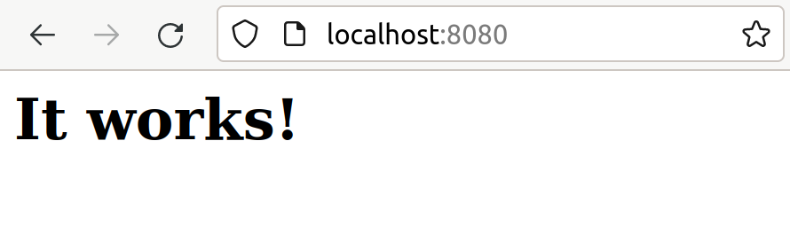
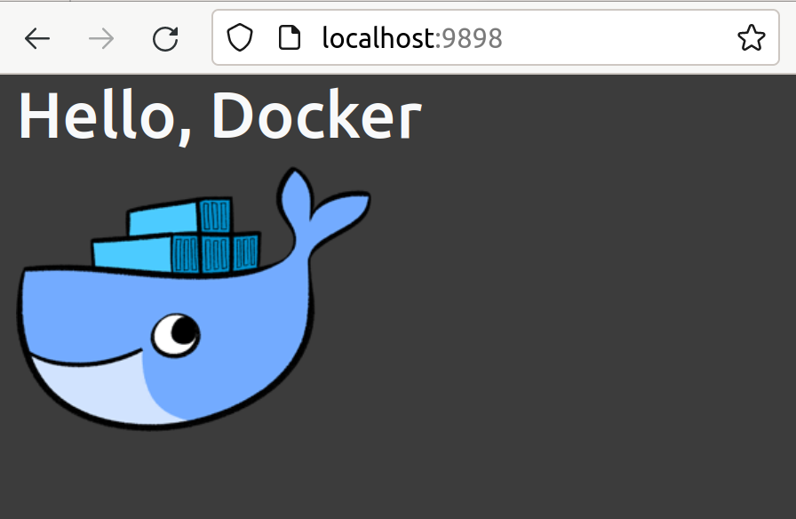

**Basic Setup**
- first, you should pull the official `httpd` container
```shell
docker pull httpd
```
- create a container out of this image
```shell
docker container run  -d --name first_apache_container -p 8080:80 3a4ea134cf8e
```
- visit `localhost:8080` ,you shuould see 



**Task1**
The goal is to host a static html file inside the container, and httpd server will serve it to us if we visited local host with the configured port.

```shell
docker container run -itd --name fancy_website -p 9898:80 -v (pwd)/src:/usr/local/apache2/htdocs httpd:latest
```
- if you visited `localhost:9898` you will see the following page.



:tada: Congratulationos, you've just hosted your first website on Apache web server :heart:

**Task2**

The goal is to create our own custom image from the official `hhpd` image and to put new static html file inside of it's filesystem as we did in the previous task.

- create `Dockerfile`
```shell
touch Dockerfile
```
```shell
FROM httpd:latest
VOLUME . /usr/local/apache2/htdocs
COPY ./my-httpd.conf /usr/local/apache2/conf/httpd.conf
```


